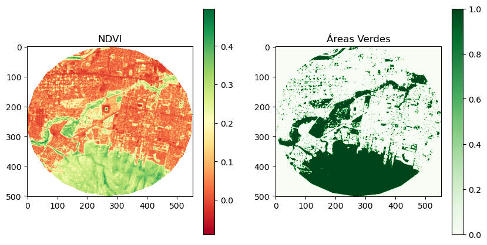

# Impact of Green Areas on Air Quality in Monterrey: A Multivariate Study

## Overview
This project examines the connection between green coverage and air quality in Monterrey during 2022, a city known for its high levels of industrialization and pollution. By utilizing data from the Environmental Monitoring System (SIMA) and satellite imagery from Google Earth Engine, the study evaluates the effect of urban vegetation on the concentration of key atmospheric pollutants, such as particulate matter (PM10, PM2.5), sulfur dioxide (SO₂), nitrogen dioxide (NO₂), nitrogen oxides (NOx), and ozone (O₃).

## Objectives
The main goal is to determine whether areas with higher vegetation levels have lower pollutant concentrations compared to areas with less green coverage. This analysis provides insights for environmental and urban planning policies that encourage the creation and conservation of green spaces in urban environments.

## Methodology
- **Data Collection:** Air quality data from SIMA monitoring stations was collected, along with satellite imagery from Google Earth Engine to measure the green coverage within a 2.5 km radius around each station, using the `rasterio` library in Python to calculate the percentage of green area.
  

- **Statistical Models:** Mixed-effects models were used to analyze the relationship between green coverage and pollutant concentrations, with vegetation percentage treated as a fixed effect and time as a random effect.
- **Transformations:** Box-Cox transformations were applied to ensure normality of the data before performing statistical analysis.

## Results
The study suggests that vegetation positively affects the reduction of pollutants such as NO₂, NOx, and PM10. However, some pollutants, like ozone (O₃), exhibited an opposite trend, with higher concentrations in areas with more vegetation. These findings indicate that while green spaces help improve air quality, other environmental factors also play a role in influencing pollution levels.

## Conclusions
The project provides significant evidence that green areas can play a key role in improving air quality in Monterrey. The results highlight the importance of implementing public policies that promote urban greening as a strategy to mitigate air pollution.

## Technologies Used
- Python (Pandas, Rasterio)
- Google Earth Engine
- Mixed-Effects Models
- Box-Cox Transformations

This project serves as a foundation for future research on the relationship between vegetation and air pollution in urban settings.
